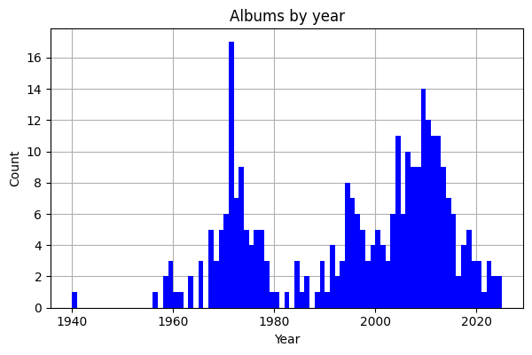

# musiclib

## Instructions for adding playlists to Pi Music Player (Android)

1. Connect phone by USB
2. Copy playlist files to phone (in correct relative path)
3. Open Pi Music Player
4. Tap 3 horizontal lines (burger menu)
5. Tap "Settings"
6. Scroll down to "Playlists"
7. Tap "Import Android Playlists"
8. Tap "Select All"
9.  Tap "Import Android Playlists"
10. Tap "Proceed"
